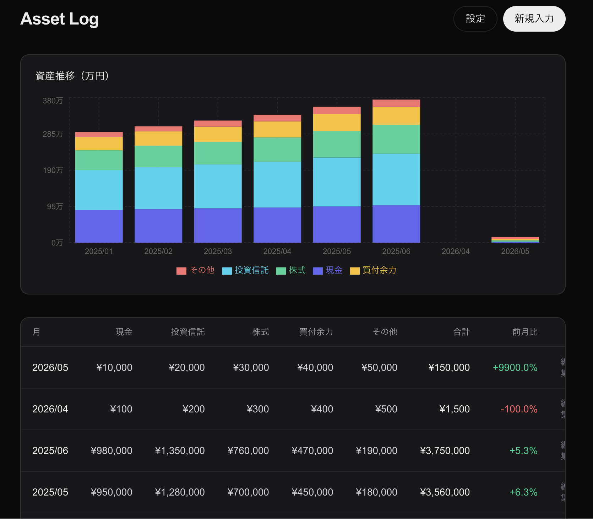
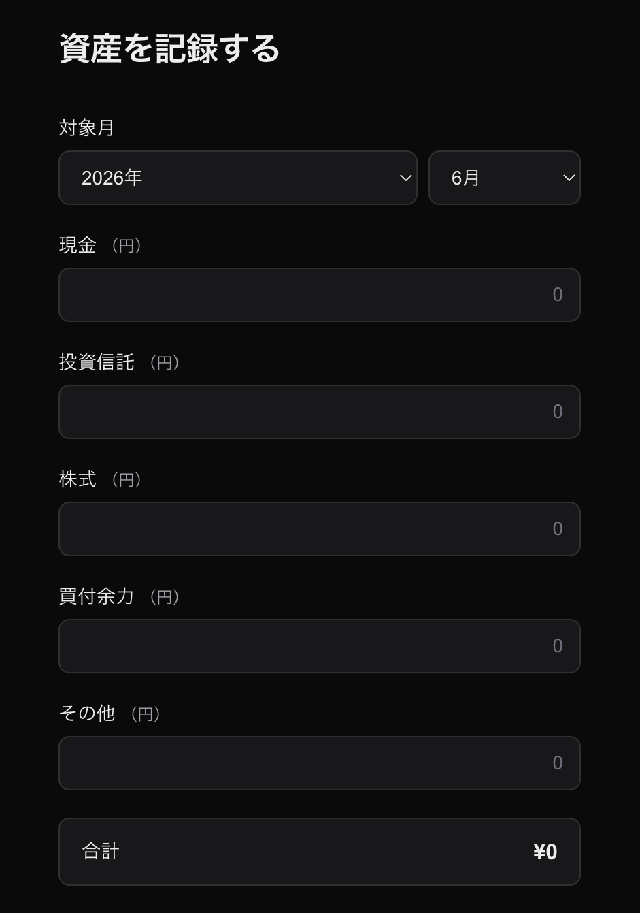
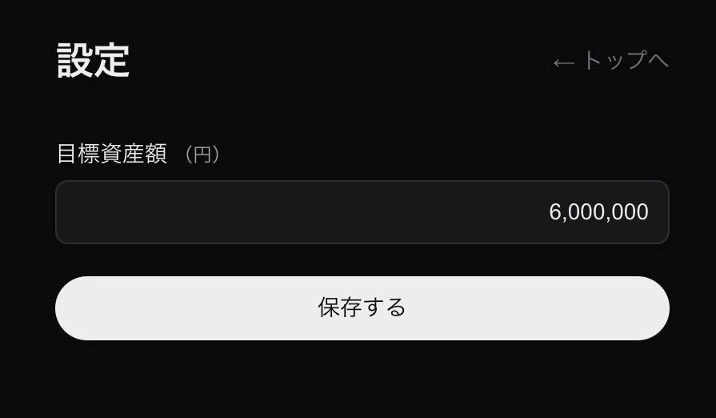

# asset-log

資産の推移を月次で記録・可視化する個人向け資産管理アプリです。

🔗 **本番URL**: https://asset-log-jet.vercel.app

---

## スクリーンショット

| ホーム | 新規入力 | 設定 |
|---|---|---|
|  |  |  |

---

## 機能一覧

- **月次スナップショット記録** — 現金・投資信託・株・買付余力・その他の5カテゴリで資産を入力
- **積み上げ棒グラフ** — Rechartsによるカテゴリ別・月別の資産推移可視化
- **目標資産額の設定** — 目標ラインをグラフ上に表示し、達成率を確認
- **スナップショット削除** — 過去データの修正・削除に対応
- **認証** — Supabase Auth によるメール/パスワードログイン

---

## 技術スタック

| カテゴリ | 採用技術 |
|---|---|
| フレームワーク | Next.js 15 (App Router) |
| 言語 | TypeScript |
| スタイリング | Tailwind CSS |
| データベース / 認証 | Supabase (PostgreSQL + Auth) |
| グラフ | Recharts |
| ホスティング | Vercel |

---

## アーキテクチャのポイント

### Row Level Security (RLS)
全テーブルにRLSを有効化し、`auth.uid() = user_id` のポリシーでデータの完全分離を実現。ユーザーは自分のデータにしかアクセスできません。

### Server Actions
フォーム送信・削除処理はすべてNext.jsのServer Actionsで実装。APIルートを設けず、サーバーサイドで直接Supabaseを操作することでコードをシンプルに保っています。

### Rechartsによるグラフ
`<BarChart>` のstackedレイアウトで5カテゴリの内訳を積み上げ表示。目標資産額は `<ReferenceLine>` で描画し、達成率を視覚的に把握できます。

---

## ローカル起動手順

### 前提
- Node.js 20+
- Supabaseプロジェクト（テーブル・RLS設定済み）

### セットアップ

```bash
# 1. リポジトリをクローン
git clone https://github.com/Jimon-air/asset-log.git
cd asset-log

# 2. 依存パッケージをインストール
npm install

# 3. 環境変数を設定
# .env.local を作成し以下を記入
# NEXT_PUBLIC_SUPABASE_URL=<your_supabase_url>
# NEXT_PUBLIC_SUPABASE_ANON_KEY=<your_anon_key>

# 4. 開発サーバー起動
npm run dev
```

### デモデータの投入
`scripts/demo-seed.sql` を Supabase の SQL Editor で実行すると、サンプルデータを投入できます。

---

## 今後の予定（v1.5）

- [ ] カテゴリ別の月次差分表示（前月比）
- [ ] CSVエクスポート
- [ ] モバイル表示の最適化
- [ ] 複数通貨・外貨資産への対応
